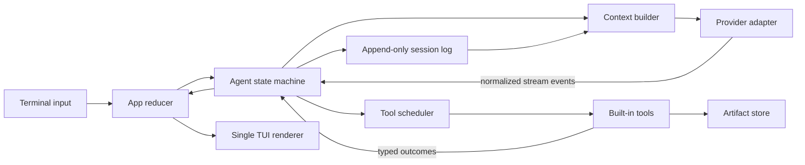

# TPI：个人终端 Coding Agent 从 0 到 1 设计文档

> 状态：实施基线（Draft 1）  
> 基线日期：2026-08-07  
> 目标读者：负责实现 TPI 的 Coding Agent 及项目维护者  
> 产品边界：只服务个人使用，不兼容第三方 Skills、插件市场或现有 Pi 扩展 API

## 0. 文档的作用

本文不是功能愿望清单，而是 TPI 的实现契约。实现者应按本文给出的优先级、模块边界、不变量和验收标准工作；如果实践证明某项设计错误，应先记录证据并修改本文中的对应决策，再修改架构。

文中的关键词含义如下：

- **必须**：违反后会破坏正确性、可恢复性或核心产品体验。
- **应该**：默认实现；只有实际证据支持时才偏离。
- **可以**：非核心增强，不得阻塞当前里程碑。

TPI 的一句话定义：

> TPI 是一个面向 Windows、以 Bash 为 Shell 方言、由 Rust 实现的个人终端 Coding Agent；它优先保证工具调用可靠、上下文连续、执行高效和流式界面稳定，而不是追求生态兼容或功能数量。

## 1. 结论先行

TPI 应从一个单进程、单二进制、单活动任务的应用开始。核心由一个显式 Agent 状态机驱动；模型、工具、会话和 TUI 通过强类型事件通信；会话采用 append-only JSONL；上下文是从会话事实派生出的有预算视图；文件修改使用 revision-bound exact edit；命令执行统一走 Git Bash `bash`（单一执行工具）；TUI 只有一个 stdout 所有者，以帧为单位合并模型增量和动画。

第一版不实现：

- 第三方 Skills、MCP、任意进程内插件或 Marketplace；
- 多 Agent、Council、Architect/Editor 双模型工作流；
- 跨会话记忆、向量数据库、后台记忆整理；
- client/server、Web UI、IDE 协议或云同步；
- 隐藏的审阅模型、自动选择辅助模型或浏览器 curator；
- 复杂权限 DSL、每条命令确认和企业沙箱策略；
- LSP、repo embedding、repo map 和完整代码索引。

这些不是被永久禁止，而是没有资格成为 0→1 的基础依赖。

## 2. 需求来源：当前 Pi 的真实使用与修改

### 2.1 审计基线

当前 Pi fork 基于 `v0.83.0`，主要修改集中在两个方向：

1. 工具执行控制：direct process、结构化状态、资源锁、调用预算、重复动作检测。
2. 可靠编辑：带 revision 的精确替换、批量预检、原子修改和受限 rebase。

全局配置又补充了中文说明、OMP 风格主题、短计划、工具显示策略和 Web 行为。它们共同表达了稳定需求，但当前实现仍是实验性补丁，不应逐行翻译为 Rust。

### 2.2 从现状迁移什么

| 当前经验或问题 | TPI 的决定 |
| --- | --- |
| Windows 上模型混用 PowerShell、Bash 和路径语法 | Windows 一等支持；Shell 工具固定 Git Bash 作为唯一执行工具 |
| 构建命令经管道或 `echo success` 掩盖退出码 | `bash` 返回模型可见的真实 `status`、`exit_code`、`signal`、`duration`；不以 stderr 判断成败 |
| `read` 展示的 revision 与 `edit` 接受格式不一致 | revision 是单独的稳定字段；展示值必须可原样回传，并有 round-trip 测试 |
| 模糊/范围编辑误删相邻代码，修括号时继续破坏结构 | exact edit 只允许删除明确给出的 `old_text`；整批预检；全成或全不成 |
| 多次 edit 导致 stale，或同文件并行写互相覆盖 | 同一次 `edit` 接受多个 replacements；同资源写入串行；stale 返回精确诊断 |
| 结构化退出状态只存在 UI details，模型看不到 | 工具结果明确分为 `model_payload`、`display_payload`、`session_metadata`，必要状态必须进入前者 |
| Agent 说“开始写”后却没有工具动作，又隐式进入新一轮 | 状态转换只由 provider finish reason、tool calls、tool results 和用户输入触发；不得凭文本猜测继续 |
| Todo 数量过多、多个事项同时进行、模型忘记更新 | 原生原子短计划，最多 7 项；未完成时恰好一个 `in_progress`；每次请求都注入当前计划 |
| 隐藏全部工具后界面缺少反馈 | 普通工具调用紧凑可见；`update_plan` 不进入聊天流水，只显示独立计划区 |
| 大量流式输出时闪烁 | 单一 renderer、dirty frame、16 ms 增量合并、buffer diff、同步更新；不以关闭动画换稳定 |
| 自定义 thinking checkpoint 导致上下文不连续 | 删除自定义思考记忆；只保留原生 session log、context projection 和安全 compaction |
| Web 扩展自动打开 localhost 页面，并可能调用昂贵模型 | Web 永不自动打开浏览器；每种模型角色显式配置；默认不存在审阅模型 |
| `find /`、猜路径、扫描错误目录浪费工具调用 | 内建有界 `list/search`；路径以 workspace-relative `PathRef` 传递；工具返回路径是权威来源 |

### 2.3 不迁移当前补丁中的缺陷

以下做法不得带入 TPI：

- 用 Bash 命令正则猜测工具是否只读；
- 把所有 Bash/Run 永久视为同一个全 workspace 写锁后仍声称支持高并发；
- 任何无关写入都重置全局重复调用计数；
- 通过异常表示正常的工具失败；
- 通用的“合并任意工具调用”扩展接口；
- 进程级全局 snapshot singleton；
- 路径大小写未规范化的 Windows 文件键；
- prototype monkey patch 汉化 UI 或隐藏工具；
- 跳过旧测试却没有用新协议测试覆盖同一风险；
- 把临时文件绝对路径直接塞进模型上下文；
- line-range edit、fuzzy whitespace edit 和自动猜测式修复。

### 2.4 迁移矩阵

| 当前资产 | 迁移方式 |
| --- | --- |
| versioned exact edit 与相关测试 | 保留行为契约和失败样例；用 Rust 重写，不复制 TypeScript wrapper |
| `run`、Bash `pipefail`、结构化进程状态 | 重写为统一 process supervisor；确保关键状态在 model payload 中 |
| resource locks、run limits、repeat detection | 保留目标，重新设计资源 stamp、watchdog 和 typed access；不迁移正则分类 |
| 原子 `update_plan` 原型 | 作为 core state 重写并补测试；不再依赖插件恢复状态 |
| `quiet-tools` | 替换为原生 display visibility policy；普通工具可见，plan call 隐藏 |
| 中文命令/设置说明 | 直接写入 Rust command/setting metadata，不 monkey patch |
| `omp-inspired` 与动画偏好 | 转成 semantic theme 和单 renderer 帧调度 |
| `web-search.json` 行为 | 保留“不弹浏览器、模型固定/关闭”的配置语义，不移植 browser curator |
| 全局 `APPEND_SYSTEM.md` | 精简迁入 `~/.tpi/SYSTEM.md`；工具能保证的行为从 prompt 移到代码 |
| 旧 Pi sessions | 默认不做格式兼容；Pi 与 TPI 并存，必要时以后写一次性离线导入器 |
| npm 插件及物理残留 | 全部不迁移，不为其保留兼容接口 |

### 2.5 当前实现的成熟度

审计基线中有 19 个 tracked 改动和 9 个 untracked 文件。定向的 execution-control 测试 6/6 通过，run 与 versioned-edit 测试 21/21 通过；但原工具 suite 仍有 3 个失败、33 个用例被 skip，且防 full-redraw 回归测试被删除。这说明现有代码足以证明需求和部分协议，却不足以作为“已验证实现”。

尤其需要记住：当前 Pi 的 OpenAI Completions serializer 不会把 tool `details` 发给模型，因此 `run` 中看似权威的 `status/exitCode` 主要停留在 UI/session。TPI 必须先建立 payload 分层和端到端测试，再迁移具体行为。

### 2.6 产品优先级

优先级从高到低固定为：

1. **正确性**：工具不能谎报结果，编辑不能越界，状态不能丢失。
2. **执行效率**：减少无意义调用、重复搜索、重复读取和隐藏模型调用。
3. **上下文连续性**：长任务经过 compaction 后仍知道目标、约束、当前动作和验证状态。
4. **交互质量**：流式输出稳定、动画顺滑、工具反馈清楚、中文说明自然。
5. **扩展性**：只为已经出现的个人需求留下清晰边界，不预建生态。

## 3. 设计原则与系统不变量

### 3.1 设计原则

TPI 采用《A Philosophy of Software Design》式的约束：

- 优先降低系统的认知复杂度，而不是减少代码行数。
- 模块应当“深”：接口小而稳定，内部吸收复杂性。
- 把 provider 差异、Windows 进程管理、终端绘制和 edit rebase 分别封装，不能让差异泄漏到 Agent loop。
- 常用路径必须简单；少见能力不得迫使每个调用都携带复杂配置。
- 能通过设计消除的错误状态，不交给调用者反复处理。
- 不为未来可能出现的第二个实现提前创建抽象层。

### 3.2 必须始终成立的不变量

1. 一个 session 同时至多有一个 active run。
2. 一个 provider response 对应一次明确的状态转换；`finish=stop` 且无 tool call 时 run 结束，不自动补一次模型调用。
3. 每个 tool call 必须恰好产生一个终态结果：`succeeded`、`failed`、`timed_out`、`cancelled`、`interrupted` 或 `rejected`。
4. 工具结果按模型原始 call index 回填，即使执行发生并行。
5. 模型能看到判断下一步所需的状态；不能只在 UI metadata 中保存退出码或 stale 原因。
6. 任何文件写入都必须基于明确意图：创建新文件，或对已知 revision 做乐观并发校验后的修改。
7. `edit` 不能删除 `old_text` 之外的未声明内容。
8. session log 是事实源；TUI transcript、上下文和统计都是 projection。
9. compaction 不能切开 tool call/result 对，也不能覆盖原始 session 事实。
10. 私有 reasoning 不是长期事实来源；事实只能来自用户输入、已提交的 assistant 内容或工具证据。
11. stdout 只允许 TUI renderer 写入；其他模块只能发送事件。
12. 模型选择必须可见、可审计；TPI 不能静默切到另一个更贵的模型。

## 4. 总体架构



### 4.1 进程模型

第一版是单进程、单二进制 `tpi.exe`：

- 一个 Tokio runtime；
- 一个 App reducer 持有可展示状态；
- 一个 Agent task 持有执行状态机；
- provider 和每个 tool execution 是受监管的子任务；
- 一个 renderer 独占终端；
- 一个 session writer 顺序追加 durable events。

不采用 client/server。Codex CLI 的 typed submission/event queue 和清晰 item 生命周期值得借鉴，但个人本地工具没有必要引入 app-server、多 transport 和协议版本协商层。[Codex protocol](https://github.com/openai/codex/blob/main/codex-rs/docs/protocol_v1.md)

### 4.2 初始代码组织

初始只创建一个 Cargo package，使用内部模块而不是一开始拆成多个 crate：

```text
tpi/
├─ Cargo.toml
├─ Cargo.lock
├─ src/
│  ├─ main.rs              # 参数解析、依赖组装、启动与退出
│  ├─ app.rs               # reducer、输入路由、应用生命周期
│  ├─ config.rs            # 配置加载、优先级、模型角色
│  ├─ agent/
│  │  ├─ mod.rs
│  │  ├─ machine.rs        # 唯一 Agent 状态机
│  │  ├─ scheduler.rs      # tool batch、资源冲突、顺序回填
│  │  └─ limits.rs         # 预算与无进展检测
│  ├─ provider/
│  │  ├─ mod.rs            # 小型 Provider trait、规范化事件
│  │  └─ openai_compat.rs  # 首个且唯一的 provider adapter
│  ├─ context/
│  │  ├─ mod.rs            # context projection
│  │  └─ compaction.rs     # 安全边界、摘要 schema、预算
│  ├─ session/
│  │  ├─ mod.rs            # durable event、读取与恢复
│  │  └─ artifact.rs       # 完整工具输出与 opaque reference
│  ├─ tool/
│  │  ├─ mod.rs            # registry、ToolOutcome、schema
│  │  ├─ files.rs          # read/list/search
│  │  ├─ edit.rs           # snapshot、revision、exact edit、write
│  │  ├─ command.rs        # bash 对外工具
│  │  ├─ plan.rs           # 原子短计划
│  │  └─ web.rs            # v1 后段加入
│  ├─ process/
│  │  ├─ mod.rs            # child lifecycle、流、timeout、取消
│  │  └─ windows.rs        # Git Bash 解析与 Job Object
│  └─ tui/
│     ├─ mod.rs            # renderer event loop
│     ├─ model.rs          # ViewModel，只读渲染输入
│     ├─ transcript.rs
│     ├─ editor.rs
│     └─ theme.rs
└─ tests/
   ├─ fixtures/            # fake provider、录制流、错误样例
   ├─ agent_flow.rs
   ├─ edit_contract.rs
   ├─ process_contract.rs
   ├─ compaction.rs
   └─ tui_streaming.rs
```

只有出现第二个真实消费者，且边界已经稳定，才考虑提取 `tpi-core`、`tpi-tools` 等 crate。不要先创建一组空 crate 再寻找它们的职责。

### 4.3 两类事件

必须区分 ephemeral runtime event 与 durable session event。

Ephemeral event 用于流式 UI，不逐 token 写盘：

```rust
enum RuntimeEvent {
    AssistantDelta { request_id: RequestId, kind: DeltaKind, text: String },
    ToolProgress { call_id: ToolCallId, chunk: OutputChunk },
    AnimationTick,
    InputChanged,
}
```

Durable event 只记录已提交事实：

```rust
enum SessionEvent {
    UserSubmitted { content: String },
    UserSteered { content: String },
    RunStarted { model: ModelRef, limits: RunLimits },
    AssistantMessageCommitted { message: AssistantMessage },
    ToolRequested { call: ToolCall },
    ToolStarted { call_id: ToolCallId },
    ToolCompleted { call_id: ToolCallId, outcome: StoredToolOutcome },
    PlanReplaced { plan: Plan },
    CompactionCommitted { covered: EventRange, summary: CompactSummary },
    RunCompleted { reason: CompletionReason, usage: Usage },
}
```

流中断时，未提交的 assistant delta 可以丢弃。恢复器为每个已经请求但缺少 `ToolCompleted` 的 call 追加一个合成 `ToolCompleted(status=Interrupted)`：model payload 明确写 `effect_unknown`，下一次请求把它作为原 tool call 的结果发送。绝不能自动重跑可能产生写入的工具；模型必须先重新读取相关文件或状态。

## 5. Rust 技术选型

### 5.1 基线

- Rust stable `1.97.x`，`edition = "2024"`，`rust-version = "1.97"`。版本基线来自 [Rust 官方发布记录](https://blog.rust-lang.org/releases/) 和 [Edition 2024 指南](https://doc.rust-lang.org/stable/edition-guide/rust-2024/index.html)。
- `Cargo.lock` 必须提交；依赖按 minor 系列声明，由锁文件固定可复现版本。
- 默认目标是 `x86_64-pc-windows-msvc`。Linux/macOS 只要求不被架构封死，不作为 v1 验收平台。

### 5.2 依赖决策

| 领域 | 选择 | 理由 |
| --- | --- | --- |
| async runtime | `tokio 1.53` + `tokio-util` | process、signal、channel、timer 和网络统一；`CancellationToken` 负责结构化取消 |
| HTTP/SSE | `reqwest 0.13` + `eventsource-stream 0.2` | rustls、流式 body、简单 SSE building block；不使用隐藏重试策略的高级 Agent SDK |
| HTML 转文本 | `html2text 0.17` | 有界 HTML 解析与纯文本输出；v1 不自研浏览器或 JS runtime [html2text docs](https://docs.rs/html2text/latest/html2text/) |
| 序列化 | `serde`、`serde_json`、`toml` | provider、session、配置的稳定基础 |
| 标识符 | `uuid 1`（UUIDv7） | 本地生成、按时间大致有序，统一 session/run/request/tool/event ID |
| 时间 | `time 0.3` | session 使用 UTC RFC 3339；运行耗时仍用单调 `Instant` |
| tool schema | `schemars 1.2` | 从参数类型生成 JSON Schema，减少描述与实现漂移；复杂不变量仍手工校验 |
| CLI | `clap 4.6` derive | 参数定义与帮助文本集中、成熟 |
| TUI | `ratatui 0.30`（使用其 Crossterm re-export） | 跨平台、buffer diff、inline viewport、可控 renderer；避免直接依赖不一致的 Crossterm 版本 [Ratatui docs](https://docs.rs/ratatui/latest/ratatui/) |
| 错误 | `thiserror` | 模块边界使用可匹配的 typed error；不把正常工具失败变成无类型异常 |
| 日志 | `tracing` + `tracing-subscriber` | span 可关联 session/run/turn/tool；日志写文件而非 stdout [Tracing docs](https://docs.rs/tracing/latest/tracing/) |
| revision | `blake3` | 对原始字节快速计算内容 revision；协议传完整 256 bit digest，UI 才使用短前缀 |
| diff | `similar 3.1` | Myers/Patience/unified diff；仅用于展示和验证，不用于猜测式修改 [similar docs](https://docs.rs/similar/latest/similar/) |
| 文件遍历 | `ignore` + `regex` | 自己提供有界、遵循 `.gitignore` 的 list/search，不依赖系统一定安装 `rg` |
| 路径 | `camino` | model-facing UTF-8 path 与内部 `std::path::PathBuf` 分离，避免到处手写转换 |
| Markdown | `pulldown-cmark 0.13` | 流式文本完成后做稳定 Markdown 解析 [pulldown-cmark](https://docs.rs/crate/pulldown-cmark/latest) |
| 代码高亮 | `syntect 5.3` | 成熟、无需 LSP；仅在可见区域按需高亮 [syntect docs](https://docs.rs/syntect/latest/syntect/) |
| Unicode | `unicode-segmentation`、`unicode-width` | 中文、emoji、组合字符和光标宽度正确 |
| 凭据 | `keyring 4.1` | Windows 使用 Credential Manager，不把 API key 写进 TOML [keyring docs](https://docs.rs/keyring/latest/keyring/v1/index.html) |
| Windows API | `windows-sys` | Job Object、进程树终止和可靠文件替换只在 `cfg(windows)` 下使用 |
| 测试 | `proptest`、`insta`、`tempfile` | 编辑属性、TUI snapshot、隔离文件系统 |

不采用 SQLite：目前没有多进程并发查询、全文检索或跨会话记忆需求。append-only JSONL 更容易检查、恢复和迁移。需要查询时先构建可重建的小索引，不能先把事实源变成数据库。

### 5.3 首次可编译的 feature matrix

第一批依赖必须显式开启实际使用的 features，不能只照抄 crate 名称：

```toml
tokio = { version = "1.53", features = [
  "rt-multi-thread", "macros", "process", "signal", "sync",
  "time", "fs", "io-util"
] }
tokio-util = { version = "0.7", features = ["rt"] }
reqwest = { version = "0.13", default-features = false, features = [
  "rustls", "system-proxy", "charset", "http2", "json", "stream"
] }
clap = { version = "4.6", features = ["derive"] }
ratatui = { version = "0.30", features = ["scrolling-regions"] }
```

Windows target 的 `windows-sys` 至少按实际调用启用 `Win32_Foundation`、`Win32_System_JobObjects`、`Win32_System_Threading`、`Win32_System_Console`、`Win32_System_Pipes`、`Win32_Storage_FileSystem` 和相关 Security/IO features。不要启用整个 Win32 surface；以编译错误和封装模块的调用点为准收窄。

### 5.4 依赖加入规则

实现 Agent 不应在项目初始化时一次性加入上表所有依赖。只有对应里程碑开始并出现首个调用点时才加入；每个新依赖必须满足至少一项：

- 消除一类难以正确实现的平台复杂性；
- 提供核心协议所需且有充分测试的算法；
- 明显减少维护成本，而不是只减少几行代码。

## 6. Agent 状态机

### 6.1 状态

```rust
enum RunState {
    Idle,
    BuildingContext { turn: u32 },
    RequestingModel { request_id: RequestId },
    Streaming { request_id: RequestId, draft: AssistantDraft },
    SchedulingTools { turn: u32, calls: Vec<ToolCall> },
    RunningTools { turn: u32, batch: BatchState },
    AwaitingUser { call_id: ToolCallId, question: UserQuestion },
    AssemblingObservation { turn: u32 },
    Compacting { covered: EventRange },
    Cancelling { reason: CancelReason },
    Completed { reason: CompletionReason },
    Failed { error: RunFailure },
}
```

状态只能由 `AgentCommand` 或已验证的内部事件推进。UI 不能直接修改 Agent 字段。

### 6.2 一轮的精确算法

1. 接收用户消息，追加 `UserSubmitted`。
2. 如果 context budget 将溢出，只在当前没有未完成 tool call 时 prune/compact。
3. 构建 context projection，记录实际模型角色和参数。
4. 发起一次 provider request，消费规范化 stream。
5. stream 完成后原子提交一条 assistant message。
6. 若响应包含 tool calls：
   - 校验所有 schema；
   - 为每个 call 生成资源访问声明；
   - 调度执行；
   - 每个 call 得到终态 outcome；
   - 按原 call index 组装 tool messages；
   - 进入下一次模型请求。
7. 若响应不含 tool calls 且 finish reason 为 stop，立即完成 run。
8. 若 provider 返回长度限制、内容过滤或协议错误，使用明确的 `CompletionReason`/`RunFailure`，不伪装成正常完成。

`ask_user` 是唯一会进入 `AwaitingUser` 的工具。交互模式中，下一条用户输入完成该 tool result 后继续同一 run；`-p` 非交互模式返回 `interactive_input_unavailable` 并以“需要用户输入”结束，不能无限等待 stdin。

`ask_user` 必须独占一个 tool-call batch。若模型把它与 `edit/run` 等调用放在同一响应，整批都返回 `batch_rejected: ask_user_must_be_exclusive`，不执行任何副作用，让模型重新决定先问还是先做。

活动 run 中的输入路由固定如下：

- `AwaitingUser` 时普通 Enter：作为该问题答案；
- `Streaming`/`RunningTools` 时普通 Enter：追加 `UserSteered`，排队到下一个安全的 model boundary，不启动第二个 run；
- Ctrl-C 或显式 `/cancel`：立即进入 `Cancelling`，不是 steering；
- `Idle/Completed` 时普通 Enter：开始新 run。

关键约束：模型输出“我现在开始写”但没有 tool call 时，TPI 不替模型脑补动作，也不静默再请求一次。它结束本轮并把现象暴露出来。只有 tool result、用户 steering 或明确的 continuation 状态才能触发下一次模型调用。

### 6.3 Inspect → Edit → Verify 外层节奏

研究表明，固定的定位、修复、验证外层结构可以比无边界的自由循环更高效；Agentless 就采用了高度约束的 localization/repair/validation 思路。[Agentless paper](https://arxiv.org/abs/2407.01489)

TPI 不把它做成僵硬工作流，而是在 system prompt 和 runtime state 中提供三个 phase：

- `Inspect`：读取目标、调用关系、配置和现有测试；
- `Edit`：进行最小的、revision-bound 修改；
- `Verify`：检查 diff，运行最相关检查，并解释失败。

纯解释任务可以在 `Inspect` 后结束；简单新文件任务无需假装进行复杂定位。phase 用于约束常见路径，不是为了增加工具调用。

## 7. Provider 层

### 7.1 v1 支持范围

只实现用户当前实际使用的 OpenAI-compatible Chat Completions adapter，配置 `opencode-go/deepseek-v4-flash` 作为初始 primary model。不要为了“通用”提前实现 Anthropic、Gemini、Responses API 或本地模型协议。

```rust
impl OpenAiCompatClient {
    async fn stream(
        &self,
        request: ModelRequest,
        events: mpsc::Sender<ProviderEvent>,
        cancel: CancellationToken,
    ) -> Result<ModelCompletion, ProviderError>;
}

enum ProviderEvent {
    ReasoningDelta(String),
    TextDelta(String),
    ToolCallStarted { index: u32, id: String, name: String },
    ToolArgumentsDelta { index: u32, chunk: String },
    Usage(Usage),
}
```

Adapter 的职责是吸收差异：SSE 分帧、tool argument 增量拼接、`reasoning_content`、finish reason 和 usage。Agent machine 不允许出现 provider-specific JSON 字段。第一版只有一个实现，因此先使用具体 `OpenAiCompatClient`，不为假想的第二个 provider 创建 object-safe async trait；第二个真实 adapter 出现时再从已稳定的输入/事件类型提取边界。

### 7.2 模型角色

配置只定义显式角色：

- `primary`：正常 Agent loop；
- `compaction`：默认字符串值 `primary`，只有用户明确配置时才使用另一模型；
- `web_summary`：默认关闭。搜索和抓取本身不需要模型。

v1 没有 `reviewer`、`architect` 或自动 fallback model。任何模型切换必须在状态栏和 session 中记录 provider、model、reasoning level。Aider 的 architect/editor 模式会引入第二次模型调用和额外成本，因此不作为默认架构。[Aider modes](https://aider.chat/docs/usage/modes.html)

### 7.3 重试策略

- 在尚未收到任何 response event 前遇到连接错误、429 或可重试 5xx，可以最多重试 2 次，并遵守 `Retry-After`。
- 一旦流中已经出现文本、reasoning 或 tool call delta，不自动重放整个请求；否则可能产生重复工具意图。
- JSON/tool arguments 不完整时返回协议错误，保留原始片段到 artifact，不能猜补 JSON。
- 每次重试进入 session metadata 和状态栏，成本可见。

## 8. 工具协议与最小工具集

### 8.1 工具集

核心工具只包含：

| 工具 | 用途 | v1 阶段 |
| --- | --- | --- |
| `read` | 有界读取文本或 artifact | P0 |
| `list` | 有界列目录/文件，遵循 ignore | P0 |
| `search` | 有界内容搜索，返回可继续游标 | P0 |
| `edit` | revision-bound 批量 exact replacements | P0 |
| `write` | 仅安全创建不存在的新文件 | P0 |
| `bash` | 唯一命令执行工具（Git Bash，统一 pipefail） | P0 |
| `update_plan` | 原子替换短计划；不进入聊天流水 | P0 |
| `ask_user` | 只有真正阻塞时请求一个明确输入 | P0 |
| `web_search` | 发现来源，不调用模型、不打开浏览器 | P1 |
| `web_fetch` | 获取并转换原始页面 | P1 |

SWE-agent 的实验说明 Agent-Computer Interface 会显著影响解决能力：有界输出、明确编辑和带反馈的工具优于只给一个无限制 Shell。[SWE-agent paper](https://papers.nips.cc/paper_files/paper/2024/hash/5a7c947568c1b1328ccc5230172e1e7c-Abstract-Conference.html) 同时，CodeAct 表明少量可组合动作空间比大量微工具更通用。[CodeAct paper](https://proceedings.mlr.press/v235/wang24h.html) 因而 TPI 保留 direct tools 与一个 Bash 执行工具，但不堆叠几十种工具。

内建工具使用 `BuiltinTool` enum + `match` 静态分发；schema、参数类型、访问声明和执行函数放在同一工具模块。v1 不创建动态 registry、插件 ABI 或 `dyn Tool` 层。

### 8.2 统一结果

```rust
struct PreparedToolCall {
    call_id: ToolCallId,
    source_index: u32,
    tool: BuiltinTool,
    validated_args: ValidatedArgs,
    declared_access: ToolAccess,
    action_key: ActionKey,
}

struct ToolOutcome {
    status: ToolStatus,
    model_payload: ModelPayload,
    display_payload: DisplayPayload,
    session_metadata: ToolMetadata,
    evidence: Vec<EvidenceRef>,
    observed_resources: Vec<ResourceVersion>,
    artifacts: Vec<ArtifactRef>,
    timing: ToolTiming,
}

enum ToolStatus {
    Succeeded,
    Failed,
    TimedOut,
    Cancelled,
    Interrupted,
    Rejected,
}
```

`PreparedToolCall` 是 schema 校验、路径规范化、访问声明和重复指纹计算的唯一预检产物；scheduler 只消费它，不在执行途中重新猜资源。`ToolOutcome` 记录实际观察到的 revisions/artifacts，而不是事后才告诉 scheduler 本来应该锁什么。

三类 payload 不能混用：

- `model_payload`：短、稳定、有预算；必须包含状态和下一步诊断所需字段。
- `display_payload`：富文本、diff、完整可展开输出和动画状态，不自动进入模型上下文。
- `session_metadata`：原始参数摘要、资源、时间、字节数、进程信息和统计，用于恢复与评测。

预期失败（未找到、stale、退出码非零）返回 `ToolOutcome`；只有工具实现自身崩溃、序列化不可能成立等基础设施错误才返回 Rust `Err`。

### 8.3 模型可见结果格式

内部保持结构化类型；OpenAI-compatible tool result 转成稳定、紧凑的文本 envelope。例如：

```text
status: failed
program: cargo
exit_code: 101
duration_ms: 2841
output: truncated (8192/48310 bytes)
artifact: @artifact/019a.../stdout-stderr
--- tail ---
error[E0308]: ...
```

不能出现“UI 显示 failed，但模型只看到一段 stderr”的分叉。

### 8.4 有界输出默认值

| 工具 | 默认模型预算 | 继续方式 |
| --- | --- | --- |
| `read` | 200 行，最多 32 KiB | `start_line` + `line_count` |
| `list` | 200 项，默认 depth 2 | cursor / 更窄 path |
| `search` | 100 matches，单行 300 chars，最多 32 KiB | cursor / path / glob |
| `bash` | 24 KiB，保留错误相关 tail | `@artifact/...` 交给 `read` |
| `web_fetch` | 正文 48 KiB | start offset / section |

完整输出写入 session artifact store。模型使用 opaque `@artifact/<session>/<id>` 读取，不接触本机临时目录绝对路径。

`list/search` 默认 root 为当前 workspace，遵循 `.gitignore`，不跟随目录 symlink，跳过 binary 和超过 2 MiB 的普通源码候选。单次默认计算预算为 20,000 files、256 MiB scanned bytes 和 10 秒 deadline，并始终监听 `CancellationToken`。

结果必须报告 `scanned_files`、`scanned_bytes`、`elapsed_ms` 和 `stop_reason=complete|result_limit|scan_limit|deadline|cancelled`；绝不把“超出限制”伪装成“没有结果”。为分页保存一个有上限的有序结果 snapshot（默认最多 1,000 项）并让 cursor 指向该 snapshot + offset，不能每翻一页重新扫描 workspace。用户或模型可通过更窄 path/glob 发起新搜索，而不是无限提高全仓预算。

## 9. 路径模型

### 9.1 内部与模型显示分离

内部使用规范化 `CanonicalPath`，模型和文档使用 `PathRef`：

```rust
struct PathRef {
    root: RootId,          // workspace、home 或已注册 root
    relative: Utf8PathBuf,
}
```

规则：

- 普通结果显示 `src/main.rs`，不显示 `C:\\Users\\...`。
- Windows 内部比较采用 canonical path，并按文件系统语义处理大小写。
- 从工具结果复制回下一个参数的路径必须可直接使用。
- 用户显式给出绝对路径时，先映射到已知 root；无法映射才在 UI 中显示原值，不能擅自转换成错误的 POSIX 路径。
- Bash 的 cwd 由工具参数设置；模型优先使用相对路径，不通过 `cd /c/... && ...` 重建工作区。
- artifact 使用 opaque ID，不泄漏缓存位置。

这直接避免“工具已经给出仓库位置，Agent 仍然 `find /` 猜路径”的浪费。

## 10. 文件读取与可靠编辑

### 10.1 Snapshot 与 revision

每个 session 拥有自己的 bounded `SnapshotStore`，不能是进程全局 singleton：

```rust
struct FileSnapshot {
    path: CanonicalPath,
    raw: Arc<[u8]>,
    logical_lf_text: Arc<str>,
    revision: Revision,
    bom: Bom,
    line_endings: LineEndingMap,
}
```

- revision 对原始字节计算 BLAKE3；工具协议传完整 256 bit digest：`b3:<64-hex>`。UI 可以只显示前 12–16 个 hex，但复制/回传必须使用完整值。
- 协议中的 revision 是独立字段，不和 path、方括号或展示标题拼接。
- `read` 即使只向模型返回一段，也可在合理文件大小下保存完整 snapshot。
- 默认保存最多 64 个文件、每个文件 8 个 revision；淘汰只影响 rebase/诊断，不影响磁盘文件。
- 文本 v1 支持 UTF-8 与 UTF-8 BOM；二进制或无法解码的内容返回类型化结果，不做 lossy rewrite。
- `logical_lf_text` 去除 BOM，并把原始 CRLF/LF 映射成统一 `\n`；同时保存每个逻辑 byte range 到原始 byte range 的单调映射。

### 10.2 `read`

输入：

```json
{
  "path": "src/lib.rs",
  "start_line": 1,
  "line_count": 200
}
```

结果必须分别给出：`path`、`revision`、`returned_lines`、`total_lines`、`truncated` 和正文。正文统一使用 LF，因此模型复制出的 `old_text` 与匹配空间一致；行号是展示信息，不是 edit 定位协议。

### 10.3 `edit`

输入：

```json
{
  "path": "src/lib.rs",
  "revision": "b3:0123456789abcdef0123456789abcdef0123456789abcdef0123456789abcdef",
  "replacements": [
    {
      "old_text": "fn old_name() {\n    work();\n}",
      "new_text": "fn new_name() {\n    work();\n}"
    }
  ]
}
```

v1 契约：

1. `old_text` 不能为空；插入必须携带明确 anchor，新文件使用仅创建语义的 `write`。
2. `old_text/new_text` 必须使用 canonical LF；出现 `\r` 时返回 `non_canonical_line_endings`，不静默改写调用参数。
3. 每个 `old_text` 在 `logical_lf_text` 中必须恰好匹配一次。
4. replacements 不能重叠。
5. `old_text == new_text` 被拒绝为 no-op。
6. 磁盘原始字节的 current revision 必须等于输入 revision；临时文件准备完成后紧邻提交再校验一次 file identity、长度、mtime 与完整 digest。
7. 所有 replacements 先验证，随后一次性在内存应用。
8. 未触及的原始字节必须保持不变；replacement 的 `\n` 按所在文件行尾策略编码。
9. 写入同目录临时文件，调用 `sync_all()` 并关闭句柄后，使用平台替换原语提交；Windows 替换时创建同卷唯一 backup。
10. 成功提交应具有原子可见性，并返回 previous/current revision、实际 unified diff 和修改统计。
11. 替换失败时按平台错误码检查 target/temp/backup，执行受测恢复协议并保留诊断；不能笼统声称所有失败状态下旧文件必然原封不动。
12. 失败返回 `stale_revision`、`no_match`、`multiple_matches`、`overlap`、`commit_recovery_failed` 或 `unsupported_encoding` 等机器可辨诊断。

第一版严格拒绝 stale revision，不自动 fuzzy rebase。安全 rebase 只有在以下条件全部具备后才进入后续版本：

- 已有大量 property tests；
- 能证明 old snapshot 到 current file 的对应区间未改变；
- 上下文在 current file 中仍唯一；
- 外部 edit 接口仍保持相同 revision-bound 乐观并发契约；
- 任何不确定性都退回 stale，而不是猜测。

### 10.4 并发保证的边界

revision-bound edit 是乐观并发保护，不是操作系统级原子 CAS。TPI 的 resource lock 能排除自身并行写；两次 digest 校验能发现绝大多数外部编辑，但外部程序仍可能在最后一次校验与 path replacement 之间修改文件。

因此实现必须：

- 把该窗口压到最短，不能在最终校验后再做 diff、格式化或网络调用；
- Windows replacement 始终保留 backup，并在成功后核对 backup digest 是否等于 expected revision；
- 若 backup 已包含未预期的外部变化，立即进入恢复流程并返回 `concurrent_modification_during_commit`，不得报告普通成功；
- 不把 revision 描述成安全边界；它防止偶然 stale/误改，无法约束不合作的外部 writer；
- 用可控并发测试反复覆盖最终校验前后两个竞态窗口。

### 10.5 保留混合行尾

不能把整个文件 decode、统一 LF、再整体写回，否则一次局部 edit 会产生无关 diff。实现应在 decode 时维护逻辑字符范围到原始 byte range 的映射；只替换命中的原始 byte ranges。混合 CRLF/LF 文件中，replacement 使用 anchor 附近的行尾；没有邻近行尾时使用文件多数行尾，再无信息时使用平台/配置默认值。

### 10.6 `write`

`write` **只创建新文件**，不提供 replace mode：

- 先在目标同目录写入唯一 temp，`sync_all()` 后关闭；
- 使用平台 no-clobber move 把 temp 安装到目标；目标已存在则返回 `already_exists`，不得覆盖；
- 成功返回新 revision；
- 已有文件即使要整体重写，也必须通过 `edit` 显式提供完整 `old_text`。超大生成文件应由项目已有生成命令产生，而不是绕过协议。

这消除了“为了创建新文件提供 write，却允许模型绕过 edit 覆盖旧文件”的错误状态。

### 10.7 Windows 替换与恢复

临时文件必须创建在目标文件同目录。Windows edit replacement 使用 `ReplaceFileW` 并提供唯一 backup path；create-only write 使用不带 replace flag 的同卷 no-clobber move。平台逻辑封装在 edit 模块私有实现中，不泄漏到 Agent 或 process 接口。

`ReplaceFileW` 的部分失败码可能意味着原文件已被移动，因此恢复算法必须显式：

1. 在产生副作用前，把 target、expected/new revision、temp 和 backup 标识写入已持久化的 `ToolStarted` recovery metadata。
2. temp `sync_all()`、关闭句柄，紧邻提交执行最终 freshness validation。
3. 调用 `ReplaceFileW(target, temp, backup, ...)`。
4. 成功后校验 target 为 candidate、backup 为 expected；先持久化 `ToolCompleted`，再删除 backup。
5. API 失败或校验不符时，根据 target/temp/backup 的存在性和 digest 恢复 expected 文件；无法证明恢复完成时保留所有文件并返回 `commit_recovery_failed`。
6. TPI 崩溃后，session recovery 根据已持久化 metadata 检查三者，生成带 `effect=not_applied|committed|unknown` 的 Interrupted outcome，绝不盲目重放 edit。

这里承诺的是“正常成功时原子可见，并对失败执行可诊断恢复”，不是“所有 Windows API 失败都绝不改变旧路径”。Unix 后续实现可使用同文件系统 `rename`。原文件权限、BOM、未改字节、备份清理和每个官方失败类别都要有集成测试。[ReplaceFileW](https://learn.microsoft.com/en-us/windows/win32/api/winbase/nf-winbase-replacefilew)

## 11. 命令执行

### 11.1 `bash`：唯一命令执行工具

`bash` 是唯一命令执行工具，构建、测试、Git、普通程序和复合命令统一走它：

```json
{
  "command": "cargo test --package tpi edit_contract",
  "cwd": ".",
  "timeout_ms": 120000
}
```

命令是 Bash 语法字符串；shell 内建命令（`pwd`、`cd` 等）与程序执行同样通过它。
wrapper 统一启用 `set -o pipefail`，pipeline 前段失败必须可见，不要求模型每次重复书写：

```json
{
  "command": "rg 'ToolOutcome' src | sort",
  "cwd": ".",
  "timeout_ms": 30000
}
```

需要 PowerShell 时在命令中显式调用 `pwsh.exe`。v1 不提供交互 stdin/PTY，命令需要交互时返回明确限制，不能挂住等待不可见输入。

> 设计史：v1 曾拆分 direct `run`（不经 shell 的 program+args 数组）与 `bash` 两个工具。
> 实测在 Windows + MSYS 环境下，模型对“该用哪个”的选择负担（如把 `pwd` 这类 shell
> 内建误当程序执行导致 spawn 失败）大于收益，且能力上 `bash` 全覆盖；主流 harness
> （Claude Code、Codex、Gemini CLI 等）也均收敛为单一 Bash 执行工具。故合并为单一
> `bash`，每次执行都走统一受控的 Git Bash 通道。

### 11.2 Git Bash 解析

Windows 解析顺序固定且记录实际选择（随包安装见 `scripts/install-bash.ps1`）：

1. `shell.path` 显式配置；
2. 随包 Git Bash：`tpi.exe` 同目录下的 `git/bin/bash.exe`、`git/usr/bin/bash.exe`、
   `git/bash.exe`、`bash.exe`；
3. `C:\\Program Files\\Git\\bin\\bash.exe`、`C:\\Program Files\\Git\\usr\\bin\\bash.exe`；
4. PATH 中的 `bash.exe`（排除 WSL launcher）。

启动参数固定为非交互 Bash（`--noprofile --norc -c`）；cwd 通过 process API 设置。TPI 的 system prompt 明确：主机是 Windows，但 `bash` 参数必须使用 Bash 语法；需要 PowerShell 时在 bash 命令中显式调用 `pwsh.exe`。

### 11.3 状态判定

- `exit_code == 0` 通常为 succeeded；非零为 failed。
- stderr 只是一条输出流，不能单独决定失败。
- timeout 和 cancellation 是独立状态，不能伪装成 exit code 1。
- 收到 signal 或 Windows termination reason 时记录在 metadata。
- 绝不追加无条件 success marker 来“确认”执行完成。

### 11.4 输出与背压

stdout/stderr 并发读取，写入 bounded channel 和 artifact。UI 合并小 chunk；慢 UI 不能阻塞 child pipe 导致死锁。模型结果保留有限 head/tail、总字节数和 artifact ID。

### 11.5 取消与进程树

drop `tokio::process::Child` 默认不等于取消，更不能保证后代退出；每个 execution 必须绑定 turn `CancellationToken`。[Tokio Child](https://docs.rs/tokio/latest/tokio/process/struct.Child.html)

Windows 不能采用“先启动目标，再 Assign Job”的实现，因为目标可能在归组前派生子进程。v1 选择单二进制 process-host handshake：

1. 父进程启动隐藏的 `tpi.exe __process-host`；host 在控制管道上阻塞，尚未创建目标。
2. 父进程创建 Job Object，启用 `JOB_OBJECT_LIMIT_KILL_ON_JOB_CLOSE` 且不允许 breakaway，把 host 加入 Job。
3. 只有 `AssignProcessToJobObject` 成功后，父进程才通过独立 framed control pipe 发送 process spec 和 start token。
4. host 创建 target；target 及其后代自动继承 Job 归属，stdout/stderr 走独立数据管道。
5. TPI 若已处于上层 Job，依赖现代 Windows nested jobs；归组受上层限制而失败时，在 target 启动前返回 `process_isolation_unavailable`，不能静默降级为 unmanaged process。
6. 父进程崩溃或取消时关闭/终止 Job，host 与整棵目标进程树一起退出。

该握手与 `CREATE_SUSPENDED → assign → resume` 解决的是同一竞态，但更容易继续使用 Tokio 管道。实现必须分别测试“parent 在 start token 前崩溃”和“target 启动后立刻派生 child”。[Windows Job Objects](https://learn.microsoft.com/en-us/windows/win32/procthread/job-objects) [AssignProcessToJobObject](https://learn.microsoft.com/en-us/windows/win32/api/jobapi2/nf-jobapi2-assignprocesstojobobject)

Ctrl-C 行为：

1. 第一次：取消当前模型请求或工具 batch，保留 session，回到可输入状态。
2. 对满足 console/process-group 条件的进程，可以 best-effort 发送 `CTRL_BREAK_EVENT`；Windows 没有适用于所有进程的统一 graceful signal。短暂 grace window 后调用 `TerminateJobObject`，非 console/隐藏进程直接进入强制终止。[GenerateConsoleCtrlEvent](https://learn.microsoft.com/en-us/windows/console/generateconsolectrlevent)
3. 第二次快速 Ctrl-C：恢复终端后退出 TPI。

## 12. 工具调度与执行效率

### 12.1 资源访问声明

```rust
enum ToolAccess {
    Pure,
    Resources(Vec<ResourceLock>),
    WorkspaceUnknown,
}

struct ResourceLock {
    resource: ResourceId,
    mode: AccessMode, // Read | Write
}
```

- `read/list/search` 由 TPI 根据规范化 path 生成 read lock。
- `edit/write` 对目标文件生成 write lock。
- `web_search/web_fetch` 是 Pure，但受网络并发上限控制。
- `bash` v1 记为 `WorkspaceUnknown`：按源顺序串行，不与任何 workspace 文件操作重叠，但可与纯网络调用并行。不要用正则假装理解任意命令副作用。

文件资源必须表达作用域而非普通字符串：`read(file)` 是 exact scope，`list/search(dir)` 是 recursive scope，`edit(file)` 是 exact write。两个 scope 在同一 root 下存在祖先/后代包含关系且至少一方为 write 时冲突；这样 `search("src")` 不会与同时修改 `src/main.rs` 的 edit 错误并行。Windows 比较使用规范化后的文件系统语义。

该策略承认未知进程的边界，同时仍允许真正安全的内建读取并行。只有性能数据表明 process 串行是主要瓶颈时，才为少量已知 direct commands 增加类型化只读策略。

### 12.2 Batch 调度

对于一次模型响应中的 tool-call batch：

1. 先验证全部参数；schema invalid 的 call 直接产生 `rejected`，不启动。
2. 根据原 call index 和资源冲突构建 execution waves。
3. 同 wave 的无冲突 Pure/Read calls 并行，受 `max_parallel_tools` 限制。
4. Write 和 WorkspaceUnknown 按源顺序执行。
5. 不做通用 coalesce；模型应在一次 `edit` 中提交同文件多个 replacements。
6. 结果无论完成先后都按原 call index 送回 provider。
7. 任一 call 失败不自动取消无依赖的只读 call；是否继续由下一轮模型决定。

Gemini CLI 的 scheduler 也将工具生命周期和调度显式化，而不是在 UI 中直接执行工具；TPI 借鉴这种边界，但不迁移其权限和扩展复杂度。[Gemini scheduler](https://github.com/google-gemini/gemini-cli/blob/main/packages/core/src/scheduler/scheduler.ts)

### 12.3 无进展检测

重复检测是确定性的，不调用额外模型：

```text
ActionKey = hash(tool_name + canonical_json(args))
ObservationKey = hash(status + bounded_model_payload)
StateStamp = digest(tool access footprint revisions)
```

只有 `ActionKey + ObservationKey + StateStamp` 相同才算无进展重复。无关文件变化不能清空某个失败搜索的历史；相关 revision 变化后允许重试。

用于 `ObservationKey` 的 semantic payload 必须排除 duration、timestamp、随机 temp/artifact ID 等易变字段，否则同一失败会因耗时不同而逃过检测；exit code、诊断正文 digest、match count 和 revision 等保留。

默认策略：

- 相同无进展动作连续出现 2 次后，在第 3 次执行前返回 `repeated_without_progress`；
- 错误结果向模型说明前两次 outcome 摘要；
- 用户可以显式要求重试，届时记录 override；
- 未知 process 的 StateStamp 使用 `known_workspace_epoch + instruction_epoch`。known epoch 只在 TPI edit/write 成功或后续 read/search 实际观察到新 revision 时增加，绝不能因为“又运行了一次 process”自动增加；否则重复命令永远无法被识别。新用户 steering 增加 instruction epoch，允许基于新意图显式重试。

ReAct 说明推理与外部观察交替是有效模式，但循环和重复动作是典型失败点；TPI 保留 action/observation loop，同时用预算和确定性检测给它边界。[ReAct](https://react-lm.github.io/)

### 12.4 Run budgets

初始默认值继承当前使用经验，但全部可配置：

```toml
[agent.limits]
max_model_turns = 80
max_tool_calls = 160
max_wall_time_minutes = 45
max_parallel_tools = 4
max_identical_no_progress = 2
```

预算由 watchdog 实时检查，wall time 到达时主动取消，不是等下一次工具调用才发现。接近预算时状态栏提示；达到硬限制后产生明确完成原因并保留可恢复 session。

## 13. Plan：状态，不是调度器

`update_plan` 是原生同步控制操作：它不进入普通工具调度队列，但仍返回标准 tool result、计入 call budget 并记录 durable event。所谓“隐藏”只是不在聊天 transcript 渲染调用噪声。

```rust
struct Plan {
    explanation: Option<String>,
    items: Vec<PlanItem>, // 0..=7
}

enum PlanStatus { Pending, InProgress, Completed }
```

不变量：

- 最多 7 项，文本去空白后不可重复。
- 存在未完成项时，必须且只能有一个 `InProgress`。
- 每次更新替换完整计划，不使用逐条 CRUD。
- 每次 model request 的 runtime snapshot 都包含规范化计划，因此 compaction 或长对话不会让模型只靠记忆遵循 Todo。
- 简单任务不建立计划；计划不是为了增加仪式。
- UI 只显示一个紧凑 plan widget，聊天 transcript 不显示 `update_plan` call/result。

计划不自动判断业务完成，也不驱动工具。真正的调度来自 Agent 状态机和模型 tool calls；这避免 Todo 插件变成第二套不可靠的 workflow engine。

## 14. Session、恢复与 artifact

### 14.1 文件布局

```text
~/.tpi/
├─ config.toml
├─ SYSTEM.md
├─ sessions/
│  └─ <workspace-id>/
│     ├─ <session-id>.jsonl
│     └─ index.json
├─ artifacts/
│  └─ <session-id>/...
└─ logs/
   └─ tpi.log
```

`workspace-id` 由规范化 workspace path 计算，但 UI 和模型不展示该绝对路径。`index.json` 可由 JSONL 重建，使用 temp + replace 原子更新。

### 14.2 JSONL envelope

```json
{
  "schema": 1,
  "seq": 42,
  "event_id": "019a...",
  "timestamp": "2026-08-07T12:34:56.789Z",
  "session_id": "019a...",
  "run_id": "019a...",
  "type": "tool_completed",
  "payload": {}
}
```

要求：

- append-only；不原地改历史事件。
- v1 session 是线性事件流；在确实实现 conversation branching 前，不预留树编辑协议。
- durable boundary 后 flush：用户提交、assistant message 提交、tool completion、compaction 和 run completion。
- 对 `Write` 或 `WorkspaceUnknown` call，必须先 append `ToolStarted` 并等待 `sync_data()` 成功，随后才能产生外部副作用；`ToolCompleted` 持久化成功后状态机才能发起下一次模型请求。这是最小 write-ahead 顺序。
- Pure/Read 的 `ToolStarted` 可以批量 flush 以降低开销，但恢复器仍根据已提交的 ToolRequested/ToolCompleted 差集生成 `Interrupted` 结果。
- 最后一行若因崩溃不完整，恢复时只丢弃该残行并记录 recovery notice。
- 恢复时不自动重跑未完成 tool。
- schema migration 是纯函数；原文件先备份或保持只读，新格式写新文件。
- raw tool output 放 artifact，不把几十 MB 塞入 JSONL。

Pi 的 append-only session 和在完整 tool 边界 compaction 是正确方向；TPI 保留这一行为，不保留其 extension 兼容层。[Pi session](https://github.com/badlogic/pi-mono/blob/main/packages/coding-agent/docs/session.md) [Pi compaction](https://github.com/badlogic/pi-mono/blob/main/packages/coding-agent/docs/compaction.md)

### 14.3 Artifact

Artifact record 包含：opaque ID、MIME、byte length、digest、创建工具、保留策略和内部路径。UI 可直接展开文本 artifact；模型通过 `read(@artifact/...)` 有界读取。session 删除时 artifact 才随之清理，不运行后台“智能整理”。

## 15. 上下文管理

### 15.1 事实源与投影分离

完整 session log 永远保留；发送给模型的是按当前目标构建的 context projection。这和 MemGPT 区分外部持久状态与活动上下文的方向一致，但 TPI 不实现模型自主管理的长期记忆或向量存储。[MemGPT](https://arxiv.org/abs/2310.08560)

每次请求按以下顺序组装：

1. 默认 system prompt；
2. `~/.tpi/SYSTEM.md` 和项目指令；
3. 当前用户目标、明确约束和当前模型角色；
4. 当前 active prefix compaction summary（若有且只有一个）；
5. 选中的完整历史 turns；
6. 结构化 runtime snapshot：phase、active plan、相关文件 revisions、上次验证状态；
7. 最近完整 turns 与最新 tool observations；
8. 当前待处理用户输入放在尾部。

长上下文中的中部信息更容易被模型忽略，因此目标/约束靠前，最新 observation 和下一动作靠后，不能只把所有旧消息原样堆在中间。[Lost in the Middle](https://aclanthology.org/2024.tacl-1.9/)

### 15.2 渐进检索

不预加载整个仓库，也不在 v1 建 repo embedding。模型通过 bounded search 找入口，再根据新出现的符号迭代读取。RepoCoder 的结果支持“检索—生成—再检索”的迭代方式，而不是一次把仓库塞满上下文。[RepoCoder](https://aclanthology.org/2023.emnlp-main.151/)

### 15.3 Tool result pruning

compaction 前先做确定性 pruning：

- 老的成功 build 输出替换为 `status + command + exit + digest + artifact`；
- 老的 read 正文在相关 revision 未变化且后续已有引用时缩成 path/range/revision；
- 失败诊断、实际 diff、用户约束和当前计划保留更高权重；
- 当前 unresolved tool call/result 绝不裁切；
- pruning 只影响 projection，不修改 session log。

### 15.4 Compaction 触发与算法

不能只看“当前已用 token”；必须为下一次输出和工具结果预留空间：

```text
usable_input = context_window - max_output_tokens - safety_reserve
compact when projected_input > usable_input
```

在 tokenizer 不可用时，初始保守估算为 `max(ceil(utf8_bytes / 3), unicode_scalar_count)`，并通过 provider 返回的实际 input usage 校正该 model 的历史比例。中文不能只按 UTF-8 bytes/4 粗算后低估；任何校正都只能提高安全性，不能突破配置的 output reserve。

算法：

1. 只在完整 assistant/tool boundary 执行。
2. 先 prune 大 tool output。
3. 保留最近约 25% 的完整原始上下文，且不小于两个完整 turns。
4. 用显式 `compaction` 角色生成结构化 summary；默认仍使用 primary model。
5. 校验必填字段和压缩后估算；只有明显缩小才提交 `CompactionCommitted`。
6. 同一阈值区间内 compaction 失败后不反复调用模型；继续确定性 prune，仍无法容纳则明确停止并要求用户新会话/手动 compact。

Compaction 调用在状态栏显示 `compacting · provider/model`，usage 和成本计入本次 session；summary 正文不需要污染聊天 transcript。它虽是系统维护调用，也不能成为隐藏模型调用。

Compaction request 不提供任何工具 schema，设置独立的较小 output budget，并且它的返回不能触发 Agent loop。解析失败属于 compaction failure，而不是让模型继续“修正格式”再花一次调用。

多个 compaction 的覆盖语义必须闭合：projection 始终只采用最新的 active prefix summary `[0..k]`。下一次 compaction 以该 summary 加上 raw events `(k..m]` 为输入，提交新的 `[0..m]` summary，并在 projection 中排除所有 `seq <= m` 的 raw events 和更旧 summary。旧 `CompactionCommitted` 仍留在 JSONL 供审计，但不会重复注入模型。

Summary schema 固定为：

```text
Goal
Constraints
Decisions
Completed
In progress
Next exact action
Relevant files and revisions
Verification status
Failed attempts and why
```

### 15.5 Reasoning 的处理

- reasoning delta 可以在 UI 中折叠显示，也可以写入本地 session 供重放；它不进入 durable facts snapshot。
- 同一次未完成 provider turn 若协议要求回传 reasoning metadata，adapter 原样处理。
- turn 完成后，后续 context 不默认重发自由形式 reasoning。
- compaction 只总结用户内容、已提交 assistant 内容、工具证据和结构化状态，不从私有 reasoning 单独提炼“事实”。
- 不做 checkpoint、thinking-context 插件或跨会话记忆。

真正可靠的自我修正来自 compiler、test、diff 和其他外部证据，而不是让模型再读一遍自己的推理。CRITIC 的工具交互结果和关于无外部反馈自我修正局限的研究都支持这一约束。[CRITIC](https://proceedings.iclr.cc/paper_files/paper/2024/hash/fef126561bbf9d4467dbb8d27334b8fe-Abstract-Conference.html) [Self-correction limits](https://proceedings.iclr.cc/paper_files/paper/2024/hash/8b4add8b0aa8749d80a34ca5d941c355-Abstract-Conference.html)

## 16. TUI 与视觉设计

### 16.1 渲染架构

只有 renderer task 可以调用 Crossterm/Ratatui 或写 stdout。Agent、provider、tool 和日志模块只能发送事件。

默认采用 Ratatui inline viewport，保留终端 scrollback；编译时必须启用 `scrolling-regions`，稳定 transcript prefix 使用 `insert_before` 提交到活动区域上方，底部只重绘正在变化的内容。Ratatui 提供 inline viewport 与 buffer-based immediate rendering，适合这一模型。[Ratatui Viewport](https://docs.rs/ratatui/latest/ratatui/enum.Viewport.html) [Terminal API](https://docs.rs/ratatui/latest/ratatui/struct.Terminal.html)

启动时做 capability probe。终端不支持 scrolling region 时不得调用 `insert_before` 的 clear/redraw fallback，而是为本次运行切到 alternate-screen compatibility renderer，并在状态栏说明；退出时把最终回答摘要写回主屏。终端只缺 synchronized update 时仍使用普通 buffer diff，不影响 inline 模式。

Inline 活动区高度在启动/真实 terminal resize 时根据窗口计算一次，运行中不随 token 数增长。长 assistant draft 把已经闭合且不会再变化的完整行/Markdown blocks 分段提交到 scrollback，未闭合 tail 在固定活动区内滚动。计算 `insert_before` 行数时必须按当前 terminal width 和 Unicode display width 布局；已提交到 scrollback 的历史视为 immutable，resize 后只重排活动区，不能假装能原地重绘旧 scrollback。

渲染调度：

- provider delta 进入 channel 后最多等待 16 ms 合并，一帧写一次终端；
- 输入事件立即标 dirty，不等待 token batch；
- 动画时钟独立，活动时目标 60 FPS，静止时不空转；
- Ratatui 比较前后 buffer，只发差异；
- 终端支持时使用 CSI 2026 synchronized update 包围一帧；
- streaming 过程中禁止 `Clear(All)` 和逐 token 全屏 render；
- resize 触发完整布局计算，但不丢 transcript 或闪白；
- panic/退出必须恢复 raw mode、cursor 和 terminal state。

流式 Markdown 不应每来一个 token 就重建整段 transcript。每条 assistant draft 维护“已闭合 block + 未闭合 tail”：已闭合段缓存 layout，只有 tail 从最近的空行/code-fence 边界重新解析；消息完成后再做一次完整解析。spinner、tool duration 和状态文字使用固定宽度区域，避免动画本身造成整行 reflow。

Scrollback 中已经提交的 tool/reasoning 行不可原地展开。最近仍在活动区的项目可内联展开；更早项目通过只读 overlay 从 session/artifact 加载详情，关闭 overlay 后回到原界面，不改写历史终端行。

### 16.2 信息层级

不使用大面积实色“聊天气泡”。默认视觉结构：

- 用户消息：细紫红左 rail + 小型 `you` 标签，背景沿用终端背景；
- assistant：无填充卡片，正文为主；
- thinking：dim italic，可折叠，流式时有轻微动画指示；
- tool：单行 `icon name target duration status`，运行中动画，完成后可展开；
- failed tool：保留红色状态和关键 tail，不自动展开几十屏；
- plan：编辑器上方独立紧凑区域，不出现在 transcript；
- footer：workspace、model、reasoning、context usage、cost 和运行状态；
- editor：硬件 cursor 放在真实输入位置，优先保证中文 IME。

只有配置中存在明确 pricing 时才计算货币成本；否则显示 token usage 与 `cost unknown`，不能用过期价格猜测。

### 16.3 主题

默认主题 `omp`，延续当前偏好但使用语义 token，而不是组件硬编码颜色：

```text
background      terminal/default
surface         #211522
surface_subtle  #1b1724
primary         #cba6f7
accent          #f38ba8
info            #89dceb
success         #a6e3a1
warning         #f9e2af
error           #f38ba8
text            #cdd6f4
muted           #7f849c
```

背景默认透明/terminal default；`surface` 只用于选中项、浮层或极小区域。命令和设置说明原生中文，不通过 monkey patch。

### 16.4 工具可见性

每类 runtime event 有独立 `VisibilityPolicy`：

- 普通 tool call：显示；
- tool progress：折叠成当前一行；
- `update_plan`：聊天隐藏，plan widget 显示；
- reasoning：默认显示但可折叠；
- debug/internal event：只写日志；
- display visibility 绝不能改变 model context 或 durable session。

## 17. Web 工具

Web 属于 v1 后段，不阻塞核心 Agent。初始搜索后端固定为 Brave Web Search API；只调用标准 Web Search endpoint，不调用其 LLM/Answers endpoint，从而避免隐藏模型成本。API key 存 Credential Manager。[Brave Search API](https://api-dashboard.search.brave.com/app/documentation/web-search/get-started)

`web_search`：

- 参数：query、count、freshness、domains；
- 返回 title、URL、snippet、published time（若有）；
- 只用于发现来源；结果摘要不是最终证据；
- 不打开浏览器、不自动 fetch 全部结果、不调用 summary model。

`web_fetch`：

- 使用 `reqwest`，限制 redirect、响应体大小和 timeout；
- `text/plain`/Markdown 直接读取；HTML 限制原始体积后用 `html2text` 转换，并过滤 script/style 等非正文节点；
- 返回最终 URL、status、content type、title、正文范围和 artifact；
- PDF、JS-only 页面和登录态网站在 v1 返回明确 unsupported/limited，不静默打开网页。

如未配置 Brave key，`web_search` 明确 unavailable；不得自动切换到抓取搜索结果页面或另一付费服务。`web_summary` 默认关闭；若以后启用，模型必须由用户固定，并在调用前后显示角色与成本。

## 18. 配置、命令和凭据

### 18.1 配置优先级

从高到低：CLI 参数 → workspace `.tpi/config.toml` → `~/.tpi/config.toml` → 内建默认值。最终生效配置可通过 `/settings` 查看来源，不允许“看不见的默认模型”。

示例：

```toml
[model.primary]
provider = "opencode-go"
name = "deepseek-v4-flash"
base_url = "https://example.invalid/v1"
reasoning = "max"
max_output_tokens = 16384
context_window = 1000000
supports_tools = true
reasoning_field = "reasoning_content"

[model.compaction]
use = "primary"

[shell]
kind = "git-bash"
# path = "C:\\Program Files\\Git\\bin\\bash.exe"

[agent.limits]
max_model_turns = 80
max_tool_calls = 160
max_wall_time_minutes = 45
max_parallel_tools = 4
max_identical_no_progress = 2

[context]
keep_recent_ratio = 0.25
safety_reserve_tokens = 8192

[ui]
language = "zh-CN"
theme = "omp"
show_reasoning = true
show_tools = true
show_plan_calls = false
animation_fps = 60
stream_frame_ms = 16
hardware_cursor = true

[web]
search_backend = "brave"
auto_open_browser = false
summary_model = "none"
```

真实 `base_url` 和 model capabilities 应从当前个人 provider 配置迁入；示例不能硬编码私密端点。

### 18.2 指令文件

- 内建 system prompt：短、稳定、跟随版本测试。
- `~/.tpi/SYSTEM.md`：个人全局规则。
- workspace 的 `AGENTS.md`：项目规则，从 workspace root 到 cwd 按层读取。
- 不扫描或加载 `SKILL.md`，也不解释第三方技能协议。
- 注入 context 时标明每条规则的来源，冲突采用“更具体的项目规则优先，但不能覆盖工具安全不变量”。

### 18.3 CLI 与 Slash commands

CLI 保持窄：

```text
tpi                         # 当前目录进入交互会话
tpi "修复这个测试"          # 进入交互并提交首条消息
tpi -p "解释失败原因"       # 非交互，stdout 只输出最终答案
tpi --continue              # 继续当前 workspace 最近 session
tpi --resume <session-id>   # 恢复指定 session
tpi --model <name>
tpi --no-session
```

初始 slash commands：

```text
/model       查看或显式切换 primary model
/thinking    调整 reasoning level/显示
/compact     在安全边界手动压缩
/new         新 session
/resume      选择并恢复 session
/session     查看 session 与成本信息
/settings    查看生效配置及来源
/diff        查看本轮实际文件 diff
/cancel      取消当前 run，保留 session
/help        中文命令说明
/quit        安全退出
```

不为了“丰富”加入几十个命令。功能若能在一个深模块中自动正确完成，不暴露额外开关。

### 18.4 凭据

`tpi auth set <provider>` 将 token 写入 Windows Credential Manager；配置只保存 credential label。环境变量可以作为显式覆盖，日志和 session 必须 scrub Authorization header、query token 和已登记 secrets。

## 19. 错误、日志与安全边界

### 19.1 错误分类

```rust
enum RunFailure {
    Provider(ProviderFailure),
    Context(ContextFailure),
    ToolInfrastructure(ToolInfraFailure),
    Session(SessionFailure),
    Terminal(TerminalFailure),
    BudgetExceeded(BudgetKind),
}
```

用户代码编译失败、搜索无结果和 revision stale 都不是 `RunFailure`，而是模型可处理的 `ToolOutcome`。

### 19.2 日志

- `tracing` 写 `~/.tpi/logs/tpi.log`，不污染 TUI。
- span 至少携带 session_id、run_id、turn、request_id、tool_call_id。
- 默认不记录 API key、完整 prompt 或完整源码；debug 模式也先脱敏。
- session 已保存必要对话事实，diagnostic log 只记录系统行为。

### 19.3 权限策略

TPI v1 不实现命令确认流和 permission DSL。工具以启动 TPI 的用户权限运行；这是有意的个人工具边界，不伪装成 sandbox。

可靠编辑的 revision、原子写、进程 timeout 和取消属于正确性机制，不是审批机制。UI 应清楚展示正在执行的工具，但不为普通调用弹确认框。

## 20. 测试与评测

### 20.1 测试层级

1. **Unit**：状态转换、schema、不变量、资源冲突、预算、路径规范化。
2. **Property**：exact edit、行尾映射、replacement 顺序、重叠、随机外部漂移。
3. **Integration**：fake provider → Agent loop → tool → session → context。
4. **Golden**：provider SSE、session JSONL、tool model payload、compaction summary、TUI buffer。
5. **Windows process**：Git Bash 解析、exit code、stderr、timeout、Job Object kill tree、输出洪水。
6. **Replay**：用已脱敏的真实失败会话重放，不调用付费模型。

真实 provider smoke test 必须显式设置凭据和 `TPI_RUN_LIVE_TESTS=1` 才运行；默认 `cargo test` 只使用 fake/recording，不能在 CI 或普通验证中产生模型费用。

### 20.2 必须固化的回归场景

至少包含以下 fixtures：

1. `read` 返回的 revision 可直接用于 `edit`。
2. 外部修改后旧 revision 被拒绝，文件零变化。
3. 修改括号附近代码不会删除未声明的 `Name::new(...)` 或相邻 token。
4. 多 replacement 有一个歧义时，整批零变化。
5. CRLF、LF、BOM 和 mixed line ending 的未触及字节保持一致。
6. `cargo test` 失败后模型确实看到 exit code 101。
7. stderr 非空但 exit 0 时状态仍为 succeeded。
8. Bash pipeline 的前段失败在 `pipefail` 下可见。
9. timeout/Ctrl-C 终止整个 Windows 子进程树。
10. 相同 search/read 无进展第三次被阻止；相关文件变化后允许重试。
11. provider `finish=stop` 后不发生幽灵般的额外模型调用。
12. compaction 保留目标、约束、唯一 active plan item、文件 revision、最后验证失败和下一动作。
13. 崩溃留下的半行 JSONL 可恢复；未完成写工具不自动重跑。
14. 普通工具可见，plan call 隐藏，但二者 model context 不受 UI policy 影响。
15. 高速流式输出期间不发全屏 clear，动画仍按目标帧率更新。
16. 工具给出 workspace-relative path 后，Agent fixture 不再扫描 `/` 猜位置。
17. `write` 遇到已存在文件返回 `already_exists`，目标零变化。
18. 写工具在副作用前已持久化 recovery metadata；分别在 replace 前、replace 后、ToolCompleted 前崩溃都能恢复/诊断。
19. 外部 writer 在最终 revision check 后竞争修改时，backup digest 检测到并进入恢复，而不是报告成功。
20. 两次以上 compaction 后 projection 只含最新 prefix summary，旧 raw events 和旧 summary 不重复注入。
21. `ask_user` 与其他 call 混合时整批零副作用；活动状态下 answer、steering、cancel 路由确定。
22. list/search 达到 scan budget 返回 `limit_reached` 统计；cursor 翻页不重新扫描。
23. Windows target 启动后立即派生 child，取消仍能终止 host、target 与 child。
24. 已提交 scrollback 不尝试原地展开；历史详情通过 overlay 正确加载。

### 20.3 TUI 稳定性指标

使用 Ratatui `TestBackend` 和真实 pseudo-terminal capture 两层验证：

- 初始化后 streaming path 不包含 CSI 全屏清除序列；
- 一个 frame 至多一次 stdout flush；
- 100–500 deltas/s 时按 16 ms 合并，而不是 delta 数量等于 draw 次数；
- Windows Terminal 手工基准中，输入延迟 p95 目标低于 50 ms；
- resize、中文 IME、长 tool output 和 Markdown code fence 各有回归录制；
- 降低动画 FPS 不能作为闪烁测试的通过条件。

### 20.4 Agent 效率指标

每个脱敏任务记录：

- 是否完成以及验证是否通过；
- model turns、tool calls、重复无进展次数；
- 无效 path/search 次数；
- edit apply failure、stale、误改和回滚次数；
- 输入/输出 token、模型成本、TTFT、总耗时；
- 首次有效修改耗时；
- 是否运行了与修改风险相称的验证；
- compaction 前后关键状态保留率。

不要只优化“回答看起来聪明”。工具调用数量、失败类型和外部验证才是当前 TPI 的主要质量信号。

## 21. 从 0 到 1 的实施路线

### M0：最小骨架，不铺空框架

交付：

- 初始化单 package、fmt/clippy/test 和最小 CI；
- 只定义 M1 会立即使用的 ID、SessionEvent、ProviderEvent、ToolOutcome、RunState；
- fake provider、deterministic clock/ID；
- 先落地四个会马上驱动实现的失败测试：`finish=stop` 不追加请求、revision round-trip、exit status 进入 model payload、renderer 单一 stdout owner。

验收：测试确实失败于尚未实现的行为，而不是堆一批 `#[ignore]` 占位；仓库没有空 crate、无用途 trait 或未来插件目录。

### M1：第一条可修改代码的 Walking Skeleton

这一阶段必须尽早贯通真实 coding path，而不是先做一个与工具隔离的聊天客户端。

交付：

- CLI/最小配置、OpenAI-compatible SSE 和 fake provider；
- 极简但已遵守“单 renderer”的 inline TUI，以及 `-p` 模式；
- `read`、严格 revision exact `edit`、create-only `write`、`bash`（唯一执行通道）；
- 串行 tool-call loop、模型可见 ToolOutcome；
- append-only session、写工具最小 write-ahead 和恢复；
- Windows process-host 的最小安全路径；
- Ctrl-C 取消 provider/tool。

范围可以先限制为 UTF-8、单文件、无 mixed line ending 和串行工具；不支持的输入必须明确拒绝，不能用不安全 fallback。

验收：fake provider 驱动 TPI 读取一个 fixture、修改一处代码、运行一次失败检查、再次修正并通过；真实 provider smoke test 显式 opt-in；`finish=stop` 只有一次请求；崩溃后 session 可读且写工具不自动重放。

### M2：有界读取与进程硬化

交付：

- `list/search` 的 ignore、scan budget、snapshot cursor；
- `bash`、Git Bash detection、artifact、head/tail；
- process-host/Job Object、timeout、Ctrl-Break best-effort、强制 kill；
- 输出背压、洪水与 batch 源序结果；
- PATH/PATHEXT 和 `.cmd/.bat` 受控 launcher。

验收：真实 exit code 对模型可见；stderr 不误判；pipeline 失败可见；输出洪水不死锁；立即派生的 Windows child 也无法逃出取消；scan limit 与 cursor 不触发重复全仓扫描。

### M3：编辑协议完整化

交付：

- session-local bounded SnapshotStore；
- exact multi-replacement batch；
- LF/CRLF/BOM/mixed line ending 原始 byte mapping；
- Windows backup/recovery journal 与 create no-clobber；
- unified diff、stale/concurrent-commit 诊断；
- property 与竞态测试。

验收：所有编辑不变量通过；随机测试中不存在部分 replacement 或未声明相邻内容损坏；每个模拟 ReplaceFileW 失败状态都有确定恢复结果；stale 必须重新 read。暂不实现 rebase。

### M4：调度、计划和长任务

交付：

- 资源感知 scheduler；
- deterministic no-progress detection；
- wall-clock watchdog 和所有 budgets；
- 原子短计划与 runtime snapshot；
- context pruning、safe compaction、reasoning policy。

验收：并行 read 能提速，冲突 write 不重叠，结果顺序稳定；长会话 fixture 经 compaction 后可继续准确执行；compaction 失败不循环。

### M5：稳定 TUI

交付：

- inline Ratatui renderer；
- transcript/editor/footer/plan/tool/reasoning components；
- OMP semantic theme；
- frame coalescing、synchronized update、hardware cursor；
- 中文 commands/settings。

验收：第 20.3 节全部通过；高速流式输出不闪烁；普通工具可见且 plan 无聊天噪声；异常退出能恢复终端。

### M6：Web 与 v1 收尾

交付：

- Brave `web_search` 与 bounded `web_fetch`；
- keyring auth；
- 配置来源查看；
- 当前个人 SYSTEM.md、主题和 provider 配置迁移说明；
- release profile、`cargo install --path . --locked` 验证。

验收：不打开浏览器、不调用隐藏模型；所有网络调用和模型成本可见；Windows 上能从空配置完成首次设置并执行真实 coding task。

### v1.0 Definition of Done

只有同时满足以下条件才称为 v1.0：

- 真实完成一组包含读取、修改、测试、失败修复和 compaction 的长任务；
- 没有已知会导致未声明文件内容丢失的编辑路径；
- 所有工具终态对模型和 UI 一致；
- 中断后不遗留子进程，session 可恢复；
- 大量输出不靠关闭动画维持稳定；
- 默认不会启动浏览器或第二个昂贵模型；
- 未实现 Skills/MCP/插件兼容，且核心代码没有为它们预留空框架；
- `cargo fmt --check`、`cargo clippy --all-targets -- -D warnings`、`cargo test --all-targets` 全部通过；
- 文档与实际配置/schema 一致。

## 22. 给实现 Agent 的工作规则

实现 TPI 时遵循：

1. 一次只推进当前里程碑中的一个可验证 vertical slice。
2. 修改前完整读取相关实现、调用点和测试；不能只看局部 snippet 猜接口。
3. 先实现最小稳定接口，再隐藏平台复杂性；不要先造通用框架。
4. 每次 edit 尽量小；修改后立即检查 diff，确认没有无关删除、格式化或路径变化。
5. tricky behavior 先写失败测试：edit、compaction、取消、SSE 拼接和渲染尤其如此。
6. 命令验证使用 direct process；不能用 `| head` 或尾随 `echo` 掩盖退出码。
7. 工具返回的路径、revision 和 artifact ID 是权威值；不能重新猜测或扫描根目录。
8. 新依赖只有出现首个真实用途时加入；不引入完整框架解决局部问题。
9. 不在 source 中加入“以后兼容 Skills/MCP”的空 trait、hook 或目录。
10. 不擅自 commit、push、rebase 或清理用户改动。
11. 未实际执行验证时，不能声称通过；失败要保留退出码和诊断。
12. 发现本文的决策无法成立时，用可复现测试或测量说明原因，再更新决策，不能在实现中静默绕开。

每个工作回合的汇报只需要：完成的行为、关键依据、实际验证、剩余限制。不要生成冗长 Todo，也不要把研究过程当成实现进度。

## 23. 默认 System Prompt 草案

内建 prompt 应短于个人 `SYSTEM.md`，只声明 Agent 与工具契约：

```text
你是 TPI，一个在用户工作区内执行软件工程任务的终端 Agent。

默认使用简体中文；技术标识与命令保留英文。先给结论，再给必要依据。

以文件、工具结果、测试和可靠来源为依据。修改前先读取相关实现；用户只要求分析时不要修改。优先最小修改，不创建无明确用途的抽象、依赖或文档。

主机是 Windows，但 bash 工具固定使用 Bash 语法。bash 是唯一的命令执行工具：程序、构建、测试、Git、管道、重定向和复合命令都通过它执行；shell 内建命令（pwd、cd 等）同样用 bash。不要混用 PowerShell 与 Bash；需要 PowerShell 时在 bash 命令里调用 pwsh.exe。stderr 不等于失败，以工具返回的 status 和 exit_code 为准。

优先使用 read、list、search 理解项目。所有输出均有界；需要更多内容时使用返回的 cursor、path 或 artifact。工具给出的 path、revision 和 artifact 是权威值，不要扫描 / 或猜测位置。

修改已有文件前必须取得 current revision。edit 只替换明确给出的 old_text；同文件多处修改放在一次 replacements 中。stale、缺失或歧义时重新读取和诊断，不做模糊修复。write 只创建不存在的新文件；已有文件即使整体重写也必须通过 edit 明确给出旧内容。

常见代码任务按 Inspect → Edit → Verify 推进，但简单任务不要制造流程。修改后检查实际 diff，并运行与风险相称的最低成本验证。验证失败时读取完整状态和关键输出，不盲目重复同一动作。

只有复杂、跨多个步骤的任务才使用 update_plan。计划最多 7 项，未完成时只有一个 in_progress；它是进度状态，不是额外工作流。

没有 tool call 且回复完成时，本轮结束。不要只说“开始执行”却不给出工具动作。遇到真正需要用户决定且不同选择会实质改变结果时，才使用 ask_user。

不要自动调用第二个模型、子 Agent、Skills、插件或浏览器。网络研究使用 web_search 发现来源，再用 web_fetch 阅读原文，并说明实际来源。

完成时说明：结论或修改、关键依据、实际验证、未验证或剩余限制。没有证据时不得声称已修复或测试通过。
```

个人现有 `~/.pi/agent/APPEND_SYSTEM.md` 的软件设计、Git 和表达偏好可整理后迁入 `~/.tpi/SYSTEM.md`；不要把每条临时事故都永久写进内建 prompt。能由工具协议消除的问题，应由代码消除，而不是继续增加提示词。

## 24. 研究依据与取舍

| 来源 | 借鉴 | 明确不照搬 |
| --- | --- | --- |
| [Pi agent loop](https://github.com/badlogic/pi-mono/blob/main/packages/agent/src/agent-loop.ts) / [TUI](https://github.com/badlogic/pi-mono/blob/main/packages/tui/README.md) | 流式 text/reasoning/tool 事件、append-only session、差分绘制 | 全权限 extension 生态、prototype patch、兼容负担 |
| [Codex CLI](https://github.com/openai/codex) | typed event queue、统一 executor、取消与 item 生命周期 | client/server、app-server、多 transport |
| [Gemini CLI](https://github.com/google-gemini/gemini-cli) | 显式 tool scheduler、compaction 防循环、确定性 loop detection | 确认系统、LLM loop detector、扩展体系 |
| [OpenCode](https://github.com/anomalyco/opencode) | tool part 状态、snapshot/patch、旧 tool output pruning | client/server、权限矩阵、通用生态 |
| [Aider edit formats](https://aider.chat/docs/more/edit-formats.html) | edit 协议本身需要独立评测 | 默认双模型 architect/editor、repo map 基础依赖 |
| [Claude Code workflows](https://code.claude.com/docs/en/common-workflows) | read-only planning 与隔离上下文的经验 | subagent、hooks、复杂 permission workflow |
| [SWE-agent](https://papers.nips.cc/paper_files/paper/2024/hash/5a7c947568c1b1328ccc5230172e1e7c-Abstract-Conference.html) | ACI、bounded observation、guarded edit | 无边界 shell-only 接口 |
| [Agentless](https://arxiv.org/abs/2407.01489) | localization→repair→validation 外层结构 | 把所有任务硬编码成固定 pipeline |
| [ReAct](https://react-lm.github.io/) | reason/action/observation 循环 | 无预算的自由循环 |
| [CodeAct](https://proceedings.mlr.press/v235/wang24h.html) | 少量可组合动作与 Bash escape hatch | 大量浅工具 |
| [MemGPT](https://arxiv.org/abs/2310.08560) | 持久事实与活动上下文分离 | 模型管理的跨会话记忆层 |
| [Lost in the Middle](https://aclanthology.org/2024.tacl-1.9/) | context 顺序和选择比“全塞进去”重要 | 依赖超长上下文掩盖管理问题 |
| [RepoCoder](https://aclanthology.org/2023.emnlp-main.151/) | 根据新符号迭代检索 | v1 全仓向量索引 |
| [CRITIC](https://proceedings.iclr.cc/paper_files/paper/2024/hash/fef126561bbf9d4467dbb8d27334b8fe-Abstract-Conference.html) | 外部证据驱动修正 | 默认昂贵 reviewer 模型 |

## 25. 最终边界

TPI 的价值不在于“Rust 版 Pi”，而在于把个人使用中已经证明重要的行为变成一套更小、更硬的系统契约：

- 模型只负责提出动作和解释结果；
- 状态机负责何时继续、停止、取消和 compact；
- 工具负责给出真实、结构化、可验证的观察；
- revision 协议负责阻止越界编辑；
- session 负责保存事实；
- context builder 负责选择，而不是遗忘或无限堆积；
- renderer 负责漂亮、稳定地展示，但不改变模型实际看到的内容。

只要这七个边界保持清晰，后续增加个人确实需要的能力不会破坏核心；如果它们没有先做好，增加任何 Skills、插件或高级工作流都只会放大现有问题。
